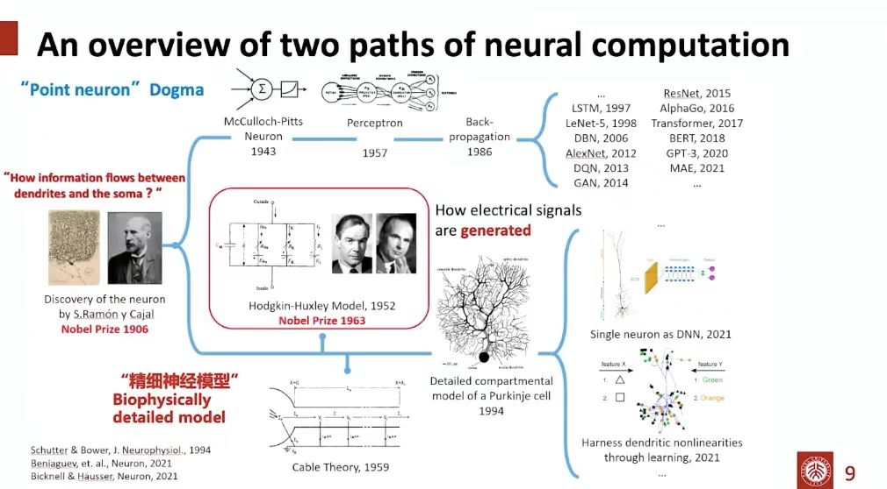

## 报告回顾

在报告《大脑精细仿真和类脑智能》中，北京大学人工智能研究院的杜凯助理研究员从现代神经科学的角度出发，就大脑的计算原理发表了相关见解: 想象一下，你正在探索一个古老的、神秘的森林，神经元具有如同森林中参天大树的丰富和多样的树突结构。对于神经元是如何运算的核心问题，科学家们走出了两条不同的道路：第一条道路，犹如走在森林的鸟瞰之路，忽略了森林中大树的复杂结构，将神经元视为一个简单的点。走这条道路的科学家们取得了巨大的成功，开启了人工神经网络和深度学习的新纪元，也为像ChatGPT这样的大模型创造了可能。第二条道路则如同探索者，倾向于深入森林，研究每一棵大树的详细结构，对神经元进行更为精细的建模，涵盖了离子通道如何产生电信号，以及电信号如何在树突中传递等问题。近年来，科学家们发现，具有复杂树突形态的精细神经元模型也具有强大的机器学习能力。 

令人惊讶的是，即使是单个的精细神经元，也能学习复杂的逻辑推理任务。因此，第二条道路被认为可能对未来的脑科学和人工智能的发展带来巨大影响。但是，当前整个领域面临的挑战是如何运行大规模的精细神经元网络。传统的仿真软件NEURON是基于CPU平台，运行效率很低。为了解决这个问题，杜凯的课题组开发了基于GPU平台的DeepDendrite系统，将运行大规模精细神经元网络的效率提高了2-3个量级，并且能够高效地训练网络，执行经典的深度学习任务。

最后，杜凯指出，要想实现类似大脑的智能，我们需要在仿真大脑的细节（Bottom-up）与从认知角度出发（Top-down）之间进行权衡。他认为，ChatGPT的成功给了我们极大的启示：大脑就像一张巨大的网络，它的深度和规模不仅取决于神经元的数量，而且还取决于每个神经元的复杂性。因此，通过从底层模拟真实的大脑神经系统，可能是实现人类级别智能的更直接的方法。

<!-- Slides can be added in a few ways: -->
<!-- 
- **Create** slides using Wowchemy's [_Slides_](https://docs.hugoblox.com/managing-content/#create-slides) feature and link using `slides` parameter in the front matter of the talk file
- **Upload** an existing slide deck to `static/` and link using `url_slides` parameter in the front matter of the talk file -->
<!-- - **Embed** your slides (e.g. Google Slides) or presentation video on this page using [shortcodes](https://docs.hugoblox.com/writing-markdown-latex/). -->

<!-- Further event details, including page elements such as image galleries, can be added to the body of this page. -->
